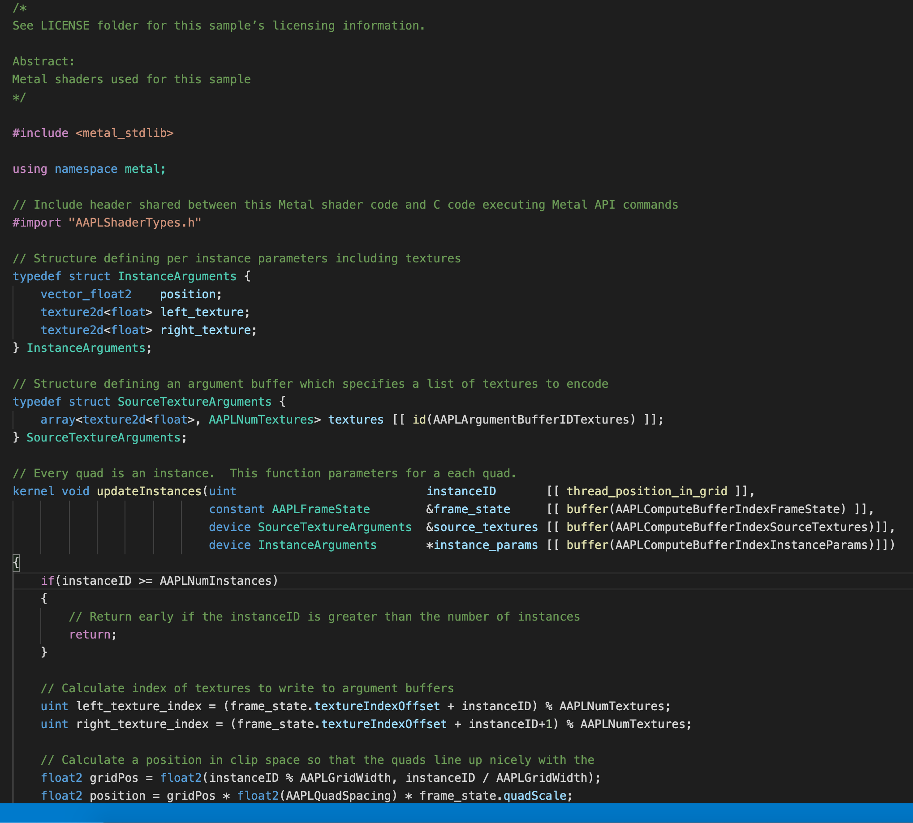

# Metal Shader Extension for Visual Studio Code

This extension provides basic support for Apple Metal Shading language.

If you have any issues, want to participate or have any suggestions feel free to participate to the project: https://github.com/tdecroyere/vscode-metal-shader

## Features

For the moment, the extension provides only syntax colorization. More features will be added in the future.

## Release Notes

### 1.0.0

Initial release of Metal Shader Extension for Visual Studio Code.
* Provide support for syntax Colorization.

